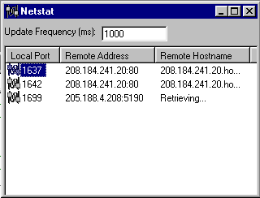



## See all open winsock connections \- API replacement for Netstat\!

### Description

This is a complete API call replacement for the dos Netstat command. The example will show all open connections, and the API calls are encapsulated in a Class module that can also retrieve all listening ports on the local computer.

This module and demonstration project also allow you to kill TCP connections - in the demonstration right click on a current connection...

Includes caching DNS lookup code to get the domain names of the servers you are connecting to! Credit to Michael Tutty for the original DNS client code.
 
### More Info
 

             |
---                |---
**Submitted On**   |2000-10-02 20:13:26
**By**             |[Nick Johnson](https://github.com/Planet-Source-Code/PSCIndex/blob/master/ByAuthor/nick-johnson.md)
**Level**          |Advanced
**User Rating**    |4.8 (223 globes from 46 users)
**Compatibility**  |VB 5\.0, VB 6\.0
**Category**       |[Windows API Call/ Explanation](https://github.com/Planet-Source-Code/PSCIndex/blob/master/ByCategory/windows-api-call-explanation__1-39.md)
**World**          |[Visual Basic](https://github.com/Planet-Source-Code/PSCIndex/blob/master/ByWorld/visual-basic.md)
**Archive File**   |[CODE\_UPLOAD103591022000\.zip](https://github.com/Planet-Source-Code/nick-johnson-see-all-open-winsock-connections-api-replacement-for-netstat__1-11834/archive/master.zip)

